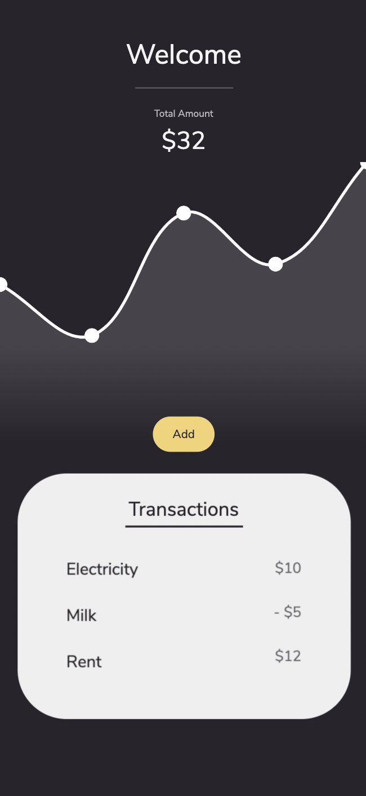
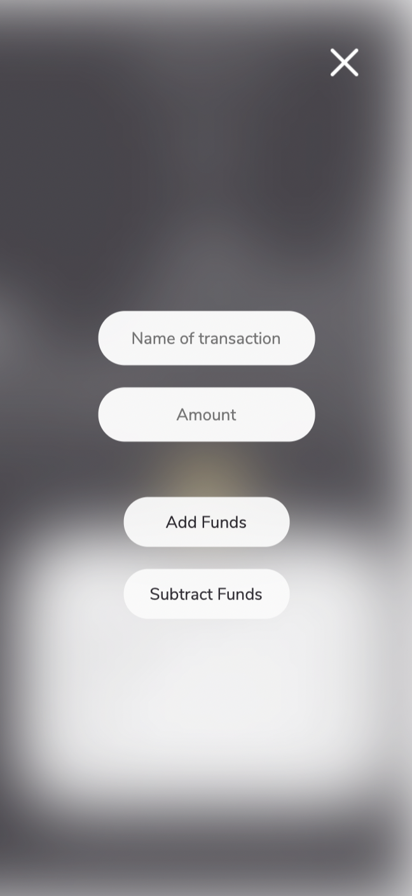

# Budget-Tracker

A Full-Stack application using mongoDB, mongoose and express | Deployed On Heroku

## Deployment

My Budget Tracker has been deployed here:
[Fitness Tracker](https://punkinut-budget-tracker.herokuapp.com/)

## Why make this?

I made this application to get a better grasp of full stack development. I was able to develop both the front end and back end code using mongoDB and express. My next challenge was turning my web page into a progresssive web app which would allow uses to download my app on any device. This feature would also allow the functionality of the web page to work offline.

## My goal

I wanted the functionality to be as simple as possible. I strived to do my due diligence and error test my application throughout. I completed my code with a simple user interface, complemented by an easy to understand user experience.

## Dashboard

Here users can view a personlised graph representing their transactions.

## Adding Transactions

In this model you can decide to add or subtract funds to your balance.

## End note

I hope you enjoyed going through my full-stack application using mongoDB 👏
